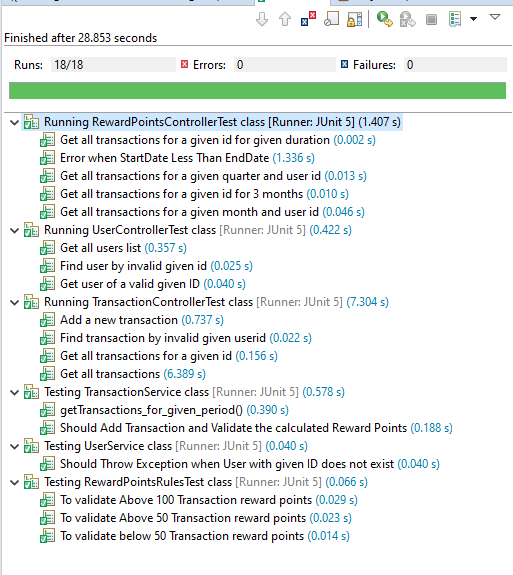

# [Retailer Reward Management ]

## Table of contents
1. [Technology Stack](#Technology-Stack)  
2. [REST EndPoints](#REST-EndPoints)
3. [DB Schema Definition](#DB-Schema-Definition)
4. [Running the app](#Running-the-app)
5. [Unit Testcases](#Unit-Testcases)


## Technology Stack
- JDK 1.8.0_261
- H2 1.4 DB (In-memory database)
- Spring Boot v2.2.1
- Lombok 1.8.10
- Hamcrest 2.1
- RuleBook 0.12 

## REST EndPoints

### REST EndPoints - User Module 
- GET http://localhost:8083/rewardcenter/getUserList ``` (List all the users)```
- GET http://localhost:8083/rewardcenter/getUserDetails/userID/1 ``` (Get the details of user with given userID)```


### REST EndPoints - Transaction Module 
- GET http://localhost:8083/rewardcenter/getAllTransactions  ``` (List all the transactions in the system)```
- GET http://localhost:8083/rewardcenter/getUserTransactions/userID/1  ``` (List all the transactions for the userID)```
- POST http://localhost:8083/rewardcenter/addTransaction/   ``` (Add a transaction in the system)```
	
	 ```json
	  Request Sample
	 {
		"amount":245.22,
		"userID":"15",
		"description":"Flooring"
		
	 }
	```
	
	```json
	Response Sample 
	(Transaction ID and Transaction Date added back in response, acknowledging that transaction is saved successfully in DB)
	{
		"transactionID": "502",
		"transactionDate": "2021-12-01",
		"amount": 245.22,
		"userID": "1",
		"description": "Flooring"
	}
	```

### REST EndPoints - Reward Points Module 
- GET http://localhost:8083/rewardcenter/getThreeMonthsPoints/userID/1 ``` (Get the aggregated points earned in last three months (starting from today) from  user with given userID)```
- GET http://localhost:8083/rewardcenter/getMonthlyPoints/userID/1/month/11 ``` (Get the aggregated points earned in the provided month (and current year) for the user with given userID)```
- GET http://localhost:8083/rewardcenter/getMonthlyPoints/userID/1/month/11/year/2020  ``` (Get the aggregated points earned in the provided month and provided year for the user with given userID)```
- GET http://localhost:8083/rewardcenter/getQuarterlyPoints/userID/1/quarter/4/year/2021 ``` (Get the aggregated points earned in the provided quarter (1/2/3/4) and provided year for the user with given userID)```
- GET http://localhost:8083/rewardcenter/getPointsForInterval/userID/4/startDate/2021-12-31/endDate/2021-12-01 ``` (Get the aggregated points earned in the provided duration for the user with given userID)```

```json
Response Sample 
(Calculate reward points for given duration and displays in below structure):
{
    "startDate": "2021-07-01",
    "endDate": "2021-09-30",
    "amount": 21041.16,
    "rewardPoints": 37396.71,
    "userID": 5,
    "transactions": [
        {
            "transactionID": 419,
            "transactionDate": "2021-09-23",
            "amount": 380.9,
            "userID": 5,
            "rewardPoint": {
                "id": 1,
                "rewardPoints": 611.8,
                "transactionID": 419
            },
            "description": "Furnishing"
        },
        .
        .
        .
    ]
}

```


## DB Schema Definition

```
CREATE SEQUENCE PROGRAM_ID_SEQ START WITH 1 INCREMENT BY 1
CREATE SEQUENCE REWARD_POINT_RULE_SEQ START WITH 3 INCREMENT BY 1
CREATE SEQUENCE USER_ID_SEQ START WITH 6 INCREMENT BY 1


CREATE TABLE REWARD_PROGRAM (
	 PROGRAMID BIGINT NOT NULL, 
	 CREATEDATE TIMESTAMP, 
	 CREATEUSER VARCHAR(50) DEFAULT 'ADMIN', 
	 DESCRIPTION VARCHAR(100) NOT NULL,
	 EXPIRYDATE DATE, 
	 STARTDATE DATE, 
	 LASTUPDATETIMESTAMP TIMESTAMP, 
	 UPDATEDBY VARCHAR(50) DEFAULT 'ADMIN', 
	 PRIMARY KEY (PROGRAMID))

CREATE TABLE REWARD_PROGRAM_RULES (
	RULEID BIGINT NOT NULL, 
	APPLICABLELIMIT DECIMAL(10,2) NOT NULL, 
	BONUSPOINTS DECIMAL(10,2) NOT NULL, 
	CREATEDATE TIMESTAMP, 
	CREATEUSER VARCHAR(50) DEFAULT 'ADMIN', 
	DESCRIPTION VARCHAR(100) NOT NULL, 
	MULTIPLIER DECIMAL(10,2) NOT NULL, 
	PROGRAMID BIGINT, 
	LASTUPDATETIMESTAMP TIMESTAMP, 
	UPDATEDBY VARCHAR(50) DEFAULT 'ADMIN', 
	PRIMARY KEY (RULEID))

CREATE TABLE TRANSACTION (
	TRANSACTIONID BIGINT GENERATED BY DEFAULT AS IDENTITY,
	AMOUNT DECIMAL(10,2),
	DESCRIPTION VARCHAR(255),
	TRANSACTIONDATE DATE,
	USERID BIGINT,
	PRIMARY KEY (TRANSACTIONID))

CREATE TABLE USER (
	USERID BIGINT NOT NULL,
	FIRSTNAME VARCHAR(255),
	LASTNAME VARCHAR(255), 
	PRIMARY KEY (USERID))

CREATE TABLE USER_PROGRAM (
	ID BIGINT GENERATED BY DEFAULT AS IDENTITY,
	PROGRAMID BIGINT,
	USERID BIGINT,
	PRIMARY KEY (ID))

CREATE TABLE USERREWARDPOINTS (
	ID BIGINT GENERATED BY DEFAULT AS IDENTITY, 
	REWARD_POINTS DECIMAL(19,2), 
	TRANSACTIONID BIGINT NOT NULL, 
	PRIMARY KEY (ID))

-Foreign keys relationship added in system
ALTER TABLE REWARD_PROGRAM_RULES ADD CONSTRAINT FKIB5FJEOCXQM1W3OBIX0P9S2QI FOREIGN KEY (PROGRAMID) REFERENCES REWARD_PROGRAM
ALTER TABLE TRANSACTION ADD CONSTRAINT FK4BO7ASLRNI69VRWVBEWUGH2FS FOREIGN KEY (USERID) REFERENCES USER
ALTER TABLE USER_PROGRAM ADD CONSTRAINT FKT2581UIK17C8OSUFKFLUCQKUN FOREIGN KEY (PROGRAMID) REFERENCES REWARD_PROGRAM

-- To insert data for users
INSERT INTO USER("USERID", "FIRSTNAME", "LASTNAME") VALUES(1, 'Sheldon', 'Cooper')
INSERT INTO USER("USERID", "FIRSTNAME", "LASTNAME") VALUES(2, 'Leonard', 'Hofstader')
INSERT INTO USER("USERID", "FIRSTNAME", "LASTNAME") VALUES(3, 'Ted', 'Baker')
INSERT INTO USER("USERID", "FIRSTNAME", "LASTNAME") VALUES(4, 'Charlie', 'Sheen')
INSERT INTO USER("USERID", "FIRSTNAME", "LASTNAME") VALUES(5, 'Jennifer', 'Anniston')

-- To insert Reward Program details
INSERT INTO REWARD_PROGRAM ("PROGRAMID","DESCRIPTION", "EXPIRYDATE" , "STARTDATE") VALUES(1, 'Retail Reward Program', TO_DATE('12/31/2022', 'MM/dd/yyyy'), TO_DATE('01/01/2021', 'MM/dd/yyyy'))

-- To insert Rules associated to Reward Program
INSERT INTO REWARD_PROGRAM_RULES (RULEID,DESCRIPTION,PROGRAMID,APPLICABLELIMIT, MULTIPLIER, BONUSPOINTS) VALUES(1,'Purchase Above 50',1,50,1,0)
INSERT INTO REWARD_PROGRAM_RULES (RULEID,DESCRIPTION,PROGRAMID,APPLICABLELIMIT, MULTIPLIER, BONUSPOINTS) VALUES(2,'Purchase Above 100',1,100,2,50)

-- To insert User mapped to Reward Program
INSERT INTO USER_PROGRAM (ID, USERID, PROGRAMID) VALUES (1,1,1)
INSERT INTO USER_PROGRAM (ID, USERID, PROGRAMID) VALUES (2,2,1)
INSERT INTO USER_PROGRAM (ID, USERID, PROGRAMID) VALUES (3,3,1)
INSERT INTO USER_PROGRAM (ID, USERID, PROGRAMID) VALUES (4,4,1)
INSERT INTO USER_PROGRAM (ID, USERID, PROGRAMID) VALUES (5,5,1)
INSERT INTO USER_PROGRAM (ID, USERID, PROGRAMID) VALUES (6,6,1)

-- To insert dummy transaction in the DB. More than 100 sample transaction added in import.sql
INSERT INTO TRANSACTION("AMOUNT", "TRANSACTIONDATE", "DESCRIPTION", "USERID") VALUES(988.48, TO_DATE('11/12/2021', 'MM/dd/yyyy'), 'Grocery', 1)
INSERT INTO TRANSACTION("AMOUNT", "TRANSACTIONDATE", "DESCRIPTION", "USERID") VALUES(945.41, TO_DATE('11/11/2021', 'MM/dd/yyyy'), 'Grocery', 1)
INSERT INTO TRANSACTION("AMOUNT", "TRANSACTIONDATE", "DESCRIPTION", "USERID") VALUES(810.83, TO_DATE('11/10/2021', 'MM/dd/yyyy'), 'Furnishing', 1)
INSERT INTO TRANSACTION("AMOUNT", "TRANSACTIONDATE", "DESCRIPTION", "USERID") VALUES(509.74, TO_DATE('11/13/2021', 'MM/dd/yyyy'), 'Household', 1)
INSERT INTO TRANSACTION("AMOUNT", "TRANSACTIONDATE", "DESCRIPTION", "USERID") VALUES(988.48, TO_DATE('11/17/2021', 'MM/dd/yyyy'), 'Grocery', 1)
INSERT INTO TRANSACTION("AMOUNT", "TRANSACTIONDATE", "DESCRIPTION", "USERID") VALUES(945.41, TO_DATE('11/18/2021', 'MM/dd/yyyy'), 'Grocery', 1)
INSERT INTO TRANSACTION("AMOUNT", "TRANSACTIONDATE", "DESCRIPTION", "USERID") VALUES(810.83, TO_DATE('11/19/2021', 'MM/dd/yyyy'), 'Furnishing', 1)
INSERT INTO TRANSACTION("AMOUNT", "TRANSACTIONDATE", "DESCRIPTION", "USERID") VALUES(509.74, TO_DATE('11/20/2021', 'MM/dd/yyyy'), 'Household', 1)```

```

## Running the app
1. Clone the project from Git  ``` https://github.com/sheetu/reward-mgmt-system.git ```
2. Build the project using ``` mvnw clean install ```
3. Run the project using ``` mvnw spring-boot:run ```

OR, You may execute the project from IDE

Application loads sample data using ``` import.sql ```

Tomcat is running on port ``` 8083 ```

H2 console is available at http://localhost:8083/rewardcenter/h2-console/
    
    **Jdbc url** - jdbc:h2:mem:rewardsystemdb
    
    **User** - sa
    
    **Password** - password


## Unit Testcases

Unit testcases written using Junit and MockMvc framework.



